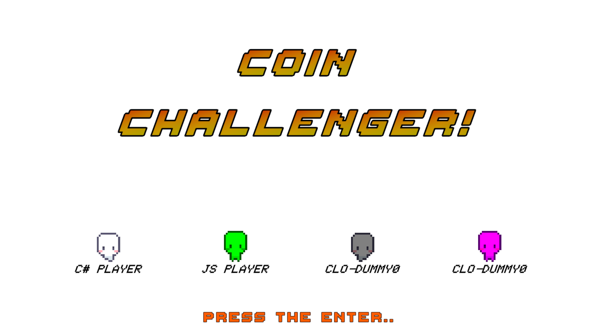
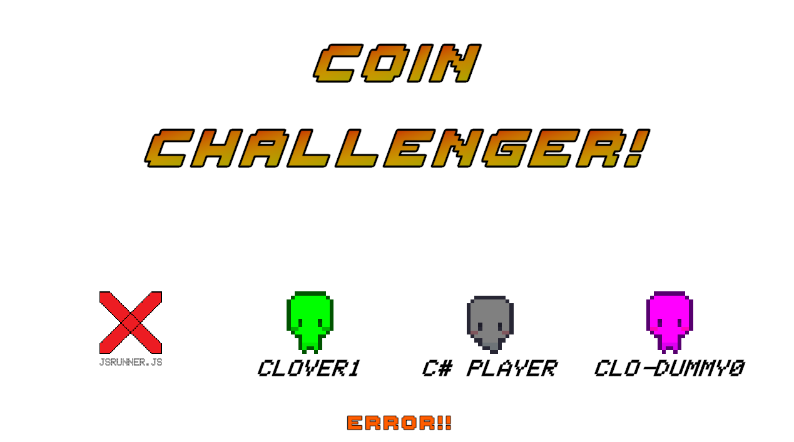

# 코인 챌린저 - 코인으로 부자되자! (COIN Challanger; be the rich!)

<br>

## 코인 챌린저는 사용자의 알고리즘 코드를 이용해 코인을 얻는 게임입니다.

<br>

<center></center>

<br>
<br>

<center> 

여러분의 알고리즘으로 부자 되는 그날까지! :rocket: 
</center>

<br>

여러분의 알고리즘 실력을 뽐내보아요.

<br>

> 간단 요약    
&nbsp; 위 게임 영상 보이시져? 저렇게 캐릭터를 이동 시켜 코인을 많이 먹는 게임입니다.    
&nbsp; - 플레이어 캐릭터를 이동시켜 코인을 가장 많이 획득하는 것이 목표!    
&nbsp; - 플레이어 캐릭터의 이동은 여러분의 알고리즘 코드로 실행!    
&nbsp; - 알고리즘을 구현한 코드 파일을 게임 실행 폴더에 넣고 게임을 실행하기만 하면 끗!

자세한 내용은 좀 더 스크롤을 내려보아요.

<br>

## 게임 돌려보기


일단! 다른 쌉소리는 뒤로하고 일단 실행부터하는 게 인지상정! 

실행하는 방법부터 시작합니다.

> 주의: **Windows 만 지원합니다.**

<br>

#### < 다운로드 & 초기 실행. >


게임은 Unity2d 로 작성되어 있습니다. 
일부 외부 에셋의 도움을 받아 작성했습니다.   
(gold metal님의 *심플 2D 플랫포머 에셋 팩*, *탑다운 2D RPG 에셋 팩* 의 일부 sprite 를 사용했습니다.    
나머지는 제가 직접 한땀한땀 도트를 찍었어요.=ㅁ=/)

게임 코드를 내려받아서 직접 Unity 를 이용해 빌드한 후 실행할 수도 있고,   
github release 에 등록된 압축파일을 받아 바이너리를 직접 실행할 수도 있습니다.   
(편한 방법으로 실행 ㄱㄱ)

<br>

 **요기에서는 github release 를 내려받아 실행하는 방법을 설명합니다.**

<br>

1. 먼저 아래와 같이 github 페이지에서 release 메뉴로 넘어갑니다.


등록된 release 중 하나를 선택한 후 아래 `Assets` 항목을 확인합니다.

<br>


2. release 항목 하단에 `Assets` 를 보면 zip 파일이 등록되어 있는 것을 확인할 수 있습니다.

<br>


zip 파일이 게임 실행 바이너리를 압축한 파일입니다. 요 파일을 다운받아 주세요.
- zip 파일은 특정 맵과 샘플 player 가 포함되어 있습니다.
- 예시> play_20x12.zip 파일은 20x12 크기의 맵과 샘플 player 가 포함되어 있습니다.

<br>

**!주의!**

인터넷에서 다운받은 파일이므로 Windows 에서 직접 실행할 수가 없습니다. zip 파일을 차단해제한 후 압축을 해제해야합니다.


(7z, 알집 등 외부 압축툴로 압축해제하면 이 과정을 자동으로 수행합니다.)

<br>

위와 같이 차단해제를 한 후 압축을 풀면 다음과 같은 파일 구조가 생성됩니다.


3. 게임은 `CoinChallenger.exe` 요 파일을 실행하면 시작됩니다.


<br>

그리고 `SELECT MODE` 가 나왔을 때 일단 그냥 `엔터` 를 한 번 눌러주시면 게임이 시작됩니다.

(일단 함 돌려봐 주셈 -/ㅇ_ㅇ->)
<br>
<br>


## 근데 그냥 실행하면 뭔가 잘 안 될 거임...

이쯤에서 게임 메뉴를 설명해드려요. ㅇㅅㅇ!

게임 시작 시 `SELECT MODE` 화면에서 게임 모드를 선택할 수 있습니다.

게임은 총 3가지 모드를 지원합니다. 각 모드는 키보드 입력을 이용해서 선택 가능합니다.
- Contest mode (**Enter key** 입력)
  - 정상 게임 모드입니다. 4명의 플레이어를 로드하여 게임을 진행합니다.
  - 로드된 플레이어가 4명 미만일 경우 나머지 플레이어는 더미로 로딩합니다.
- Test mode (**F10 key** 입력)
  - 테스트를 위한 단일 플레이어 모드 입니다.
  - 테스트 모드에서는 더미 1개만 로딩됩니다.
  - 테스트 모드에서는 로딩된 더미를 키보드 방향키로 이동시킬 수 있습니다.
- Single mode (**숫자키 1 ~ 4**)
  - 1개의 플레이어만 로딩합니다. (플레이어 게임코드 폴더의 파일 기준으로 1개만 로딩합니다.)
  - 입력된 숫자키는 로딩된 플레이어가 시작할 위치를 가리킵니다.
  - 1: 좌상단, 2: 우상단, 3:좌하단, 4:우하단 순서로 배치됩니다.

<br>

게임모드 선택이 끝나면 플레이어 로딩이 시작됩니다. 이 때 ***플레이어 호스트*** 가 함께 실행됩니다.

> **플레이어 호스트란?**    
&emsp; - 각 플레이어의 알고리즘 파일을 수행할 외부 프로세스입니다.   
&emsp; - 알고리즘 코드의 플랫폼(C#, javascript, etc)에 맞게 외부 프로세스가 실행됩니다.   
&emsp; &nbsp; &nbsp; - C# 은 ASP.NET core 8 Web api 를 이용한 호스트 프로세스가 실행됩니다.    
&emsp; &nbsp; &nbsp; - javascript 는 nodejs 를 이용한 호스트 프로세스가 실행됩니다.    
&emsp; - 게임 프로세스와 호스트 프로세스가 서로 통신하여 게임이 진행됩니다.

<br>

최초 실행 시 플레이어 호스트의 실행 등록이 필요합니다.(Windows11 기준, 아래와 같은 창이 뜨면 `허용` 을 눌러주세요.)


<br>
<br>


이후 정상적으로 게임이 로딩되면 `PRESS THE ENTER...` 메시지가 나옵니다. 



엔터 꾸깃! 해주세요. ㅇㅅㅇ/

<br>

그러면 카운트다운 이후 게임이 시작됩니다.

<br>
<br>

## 게임은 흘러갑니다.

카운트 다운 이후 게임이 시작됩니다.

본격 게임이 시작되면 맵 상의 코인을 누가누가 많이 먹나! 경쟁이 진행됩니다.    
(게임 화면에 대한 대략적인 내용은 아래와 같습니다.)


각 플레이어는 지정된 시작 위치에서 플레이어의 알고리즘 코드를 호출해 한 번에 1칸씩 이동합니다.
(더미는 빨간색 플레이어로 로딩됩니다.)

맵 위에 모든 코인이 사라지면 게임은 종료되고 획득한 점수로 순위를 매깁니다.


<br>
<br>
<br>
<br>

## 아직 이게 몬지 잘 모르겠다굽쇼?

요기까지 흐름을 아주 간단히 표시하면 이런 모양이 됩니다.

<br>


<br>

요걸 이렇게 나눠볼 수 있어요.

1. 게임 준비    
&nbsp; &nbsp;- 게임 실행 (`CoinChallenger.exe`) -> 플레이어 코드 로딩 -> 플레이어 호스트 실행(`CsharpHost.exe` / `jsHost.exe`) 

2. 게임 진행    
&nbsp; &nbsp;- 게임 내에서 플레이어 호스트로 각 플레이어의 방향 요청 ->     
&nbsp; &nbsp;- 요청받은 플레이어 호스트는 로딩된 플레이어 코드(알고리즘 코드) 를 실행    
&nbsp; &nbsp;- 이번 턴에 움직여야할 방향 반환    
&nbsp; &nbsp;- 반환받은 방향으로 게임에서 플레이어 이동.    

<br>

이제 대충 몬말인 지 알겠죠?

그래서 이제 뭘 해야하냐믄요...

<br>
<br>
<br>

## 아직까지는 그냥 샘플로만 실행되는 것이었던 것..

이제 여러분이 해야하는 건 코인을 많이 획득하기 위한 알고리즘을 작성하는 일 입니다.

> 넵, 그렇습니다.    
이 게임은 여러분이 작성한 알고리즘으로 굴러가는 게임입니다.

C# 혹은 javascript 로 알고리즘을 작성한 후, 

작성한 파일을 게임 폴더에 집어넣고, 

게임을 돌려서 결과를 확인하는 겁니다.

<br>

고럼, 이제부터 알고리즘을 작성하기 위해 필요한 것들을 본격 설명해보겠습니다. ㅇㅅㅇ!

<br>
<br>

---

게임을 진행하기 위해서는 여러분의 알고리즘 코드가 필요합니다.    
(이하 `플레이어 코드` 라고 부릅니다.)

알고리즘 코드는 C#, javascript 로 작성 가능합니다.   

이미 폴더에 들어있는 샘플 코드는 알고리즘 작성 템플릿 같은 거라고 보면 됩니다.

샘플 껍딱 처럼 여러분의 알고리즘을 작성해 주세요.

작성된 알고리즘 코드 파일은 `CoinChallenger.exe` 실행 파일 위치 기준

```
./externals/players
```

위 폴더에 보관해주시면 됩니다.(이미 샘플 코드가 들어있을 거예요.)

4개 이상의 파일이 이미 들어있다면 정상적으로 로딩되지 않을 수도 있으니    
위 폴더에 보관되는 파일 개수는 4개 이하로 유지하는 것을 권장합니다.

이제 알고리즘 작성을 위한 자세한 가이드입니다.

<br>
<br>

### <알고리즘 코드 작성 가이드 입니다.>

먼저 큰 틀에서 플레이어 코드(알고리즘 코드)를 호출하는 구조를 설명합니다.    
플레이어 로딩 이후 게임 진행 과정은 다음과 같습니다.

```
게임 프로세스 ->   
  플레이어 호스트로 MoveNext() 호출 -> 
    플레이어 코드에서 이번 턴에서 이동할 방향 리턴 -> 

게임에서 플레이어 이동
```

요런 구조로 생각하시면 됩니다.

게임 프로세스와 플레이어 호스트 간의 실제 호출 과정은 생략하고 개념적으로 플레이어 코드를 읽고 사용하는 방식을 설명합니다.      
*(구조에 대한 설명은 `C#` 기준으로 먼저 설명합니다. 각 게임 플랫폼에 대한 반복 설명은 생략합니다.)*

- 간단 용어 정의
  - 호출 : 별다른 주어가 없을 경우 게임 프로세스 -> 플레이어 호스트로 플레이어 코드를 호출하는 것을 의미합니다.

<br>

#### 1. 플레이어 코드 로딩
---

게임 모드가 선택되면 게임 프로세스는 아래 폴더에서 플레이어의 알고리즘 파일을 읽어들입니다.

```
./externals/players
```

*(게임이 인식하는 플레이어 코드 파일은 `.cs`, `.js` 확장자 파일입니다.)*

<br>

플레이어 코드가 로딩되면 실제 게임 내에서 1개 플레이어가 생성됩니다.     
그리고 게임이 진행 직전에 플레이어 코드의 `Initialize(int myNumber, int column, int row)` 를 호출하여 각 플레이어 인스턴스에 게임 정보를 전달합니다.

- 플레이어 인스턴스에서 해당 정보를 보관할 수 있도록 `Initialize(int myNumber, int column, int row)` 가 호출됩니다.
- 자신의 시작 위치와 전체 맵 그리드 정보를 전달합니다.

<br>

또한 게임 프로세스는 플레이어의 이름을 확인하기 위해  `GetName()` 를 호출합니다. 

플레이어 코드에서 이름이 반환되면 게임에서 사용됩니다.    
(플레이어 정보, 스코어 현황 등에서 사용합니다.)

<br>
<br>

#### 2. 게임 진행
---

플레이어 로딩과 맵 로딩이 끝나면 게임이 시작됩니다. 게임은 다음과 같은 방식으로 진행됩니다.

```
플레이어가 1칸씩 맵을 이동하면서 진행됩니다.    
플레이어는 한 번에 1칸 씩 이동 합니다.    
턴이 시작될 때 플레이어 코드를 호출해 이번 턴에서 플레이어가 이동할 방향을 결정합니다.    
  -- 현재 맵 정보와 플레이어의 위치를 함께 전달해 알고리즘을 수행합니다.
플레이어 코드가 방향을 반환하면 플레이어는 해당 방향으로 1칸 이동합니다.
플레이어가 이동하면서 코인과 충돌하면 코인에 지정된 점수만큼 득점합니다.(이후 코인이 삭제됩니다.)
벽을 만나면 움직이지 못하고 1턴을 소비합니다.
맵 내 모든 코인이 사라지면 게임이 종료됩니다.
```

<br>

최종적으로 게임은 플레이어 코드의 `int MoveNext(int[] map, int myPosition)` 메서드를 구현하는 것을 목적으로 합니다.

<br>

---

그렇다면 이제 진짜 코드를 구현하는 방법을 알아봐야겠죠?

다음은 샘플 코드를 예시로 각 세부 내용을 설명합니다. 

C# 플레이어 먼저 설명합니다.

<br>

```csharp
using System;

namespace CSharpPlayer
{
    /// <summary>
    /// 코드 sample 입니다. 별도의 파일에 다시 작성해주세요.
    /// <para>네임스페이스는 `CSharpPlayer`, 클래스 이름은 `Player` 로 고정해주세요.(필수)</para>
    /// <para>필수 메서드 GetName(), Initialize(), MoveNext()의 접근제한자를 public 으로 지정해주세요.</para>
    /// </summary>
    public class Player
    {
        private int _myNumber;
        private int _column;
        private int _row;

        /// <summary>
        /// Player 를 초기화 합니다. 게임 환경을 인자로 전달받습니다. 전달받은 인자는 게임 동안 유지해야합니다.
        /// </summary>
        /// <param name="myNumber">배정받은 번호.(플레이 순서)</param>
        /// <param name="column">현재 생성된 보드의 열.</param>
        /// <param name="row">현재 생성된 보드의 행.</param>
        public void Initialize(int myNumber, int column, int row)
        {
            _myNumber = myNumber;
            _column = column;
            _row = row;
        }

        /// <summary>
        /// Player 의 이름을 반환합니다. 현재 플레이어의 이름을 하드코딩하여 반환합니다.
        /// </summary>
        /// <returns>현재 플레이어 이름.</returns>
        public string GetName()
        {
            return "c# player";
        }

        
        /// <summary>
        /// 현재 턴에서 진행할 방향을 결정합니다. map 정보와 현재 플레이어의 위치를 전달받은 후 다음 이동 방향을 반환해야 합니다.
        /// <para>결정 방향은 left, up, right, down 순서로 0, 1, 2, 3 정수로 표현해야합니다.</para>
        /// </summary>
        /// <param name="map">1차원 배열로 표현된 현재 map 정보.</param>
        /// <param name="myPosition">현재 플레이어의 위치. map 배열의 인덱스로 표시됨.</param>    
        /// <returns>이번 프레임에 진행할 방향. left, up, right, down 순서로 0, 1, 2, 3 으로 표현. -1은 에러</returns>
        public int MoveNext(int[] map, int myPosition)
        {
            var random = new Random();
            var direction = random.Next(4);
            return direction;
        }
    }
}

```

위와 같이 요런 모양의 클래스를 작성하면 됩니다.

코드 작성은 어떤 툴을 사용해도 상관없습니다. 최종적으로 작성한 파일을 게임 폴더(`./externals/players`) 에 넣어두기만 하면 됩니다.    
(그래도 문법은 맞아야겠죠? 빌드 에러만 없으면 됩니다.)

클래스에서는 

```csharp
public void Initialize(int myNumber, int column, int row)
public string GetName()
public int MoveNext(int[] map, int myPosition)
```

요 3개 메서드는 반드시 구현해야합니다. (코드 설명대로 구현해야합니다.)

<br>

다음은 맵 정보 예시 입니다.


<br>

위 형태의 맵은 다음과 같이 표현됩니다.

column: 6    
row: 6
```
0       0       -1      -1      10      0
-1      0       30      30      10      -1
0       0       100     100     30      10
0       0       100     0       0       0
-1      0       0       0       0       -1
0       0       -1      -1      0       0
```

0 은 이동 가능한 공간, -1 은 벽(이동 불가), 0보다 큰 나머지 숫자는 코인입니다.

게임 내 코인은 copper, silver, gold, diamond, blackMatter 총 5가지 종류가 존재합니다.

각 코인은 아래와 같은 점수를 가지고 있습니다.

```
    Copper = 10,
    Silver = 30,
    Gold = 100,
    Diamond = 200,
    BlackMatter = 500
```

이들 코인은 map 정보에서 그대로 수치로 표현됩니다.(예시> gold 코인이 맵 정보 -int 배열- 에서 100 으로 표시됨.)

<br>
<br>

실제 호출 상황을 예로 들어보면 (위 맵으로 게임이 진행될 경우)

게임 프로세스에서는 매턴마다 플레이어 코드의 `MoveNext(int[] map, int myPosition)` 메서드 호출이 일어납니다.    
이 때 현재 맵의 정보가 `int 배열` 형태로 전달되고, 현재 플레이어의 위치 정보 역시 맵 배열의 인덱스 값으로 함께 전달됩니다.

즉, 아래와 같은 형식으로 게임 프로세스에서 플레이어 코드를 호출합니다.

```csharp
int[] map = new[] {0,0,-1,-1,10,0,-1,0,30,30,10,-1,0,0,100,100,30,10,0,0,100,0,0,0,-1,0,0,0,0,-1,0,0,-1,-1,0,0};
var direction = MoveNext(map, 21); // 플레이어가 21번째 인덱스 위치에 있음.
```

`int MoveNext(int[] map, int myPosition)` 는 0~3 까지의 정수 중 1개를 반환해야합니다. 

각 정수는 이번 턴에서 진행해야할 방향을 의미합니다. (0:left, 1:up, 2:right, 3:down)

따라서 여러분은 

요 `MoveNext(int[] map, int myPosition)` 메서드에서    
자신의 플레이어가 이번 턴에서 진행할 방향을 계산하는 알고리즘을 작성해야합니다. 

요것이 바로 이 게임의 핵심입니다 ㅇㅅㅇ!

<br>

> *주의*    
MoveNext() 의 반환값으로 -1 은 에러를 의미합니다.(정확히는 0보다 작은 수)    
MoveNext()에서 -1 이 반환되면 플레이어틑 1턴을 쉬게 됩니다.(패널티!)    
플레이어를 의도적으로 쉬게 하는 것이 아니라면 MoveNext() 에서 -1 을 반환하지 않게 하세요!

<br>

자 그럼

<span style="font-size:10;">화이팅!</span>


<br>

#### javascript 파일 작성 요령.
---

javascript 플레이어 코드는 nodejs 에서 인식할 수 있는 module 형태로 작성해야합니다. 

다음은 샘플 코드를 예시로 각 세부 내용을 설명합니다.

```js
// sample
class JsRunner {
    constructor() {
        this._column = 0;
        this._row = 0;
        this._myNumber;
    }

    // Player 를 초기화 합니다. 게임 환경을 인자로 전달받습니다. 전달받은 인자는 게임 동안 유지해야합니다.
    // int: myNumber = 할당받은 플레이어 번호. (플레이 순서)
    // int: column = 현재 생성된 보드의 열.
    // int: row = 현재 생성된 보드의 행.
    // 메서드명은 반드시 아래 메서드와 일치해야합니다.
    initialize(myNumber, column, row) {
        this._myNumber = myNumber;
        this._column = column;
        this._row = row;
    }

    // Player 의 이름을 반환합니다. 현재 플레이어의 이름을 반환합니다. (하드 코딩하는 것을 추천)
    // 메서드명은 반드시 아래 메서드와 일치해야합니다.
    getName() {
        return "javascript player";
    }

    // 현재 턴에서 진행할 방향을 결정합니다. map 정보와 현재 플레이어의 위치를 전달받은 후 다음 이동 방향을 반환해야 합니다.
    // 결정 방향은 left, up, right, down 순서로 0, 1, 2, 3 정수로 표현해야합니다.// 
    // map: int[]  1차원 배열로 표현된 현재 map 정보.
    // myPosition:int 현재 플레이어의 위치. map 배열의 인덱스로 표시됨
    // returns:이번 프레임에 진행할 방향. left, up, right, down 순서오 0, 1, 2, 3 으로 표현. (-1 은 에러)
    // 메서드명은 반드시 아래 메서드와 일치해야합니다.
    moveNext(map, myPosition) {
        let min = 0;
        let max = 3;
        min = Math.ceil(min);
        max = Math.floor(max);
        let selectedIndex = Math.floor(Math.random() * (max - min + 1)) + min;
        return selectedIndex;
    }    
}

module.exports = JsRunner; // 필수 작성.
```

nodejs 에서 module 로 사용하기 위해 class 로 작성해야하며, 최종적으로 해당 클래스를 export 해야합니다.

그 외 나머지 내용은 C# 과 동일합니다.

<br>
<br>

### 알고리즘 작성 주의 사항 (중요!!!!)
---

코드를 작성할 때 주의사항이 있습니다.    

```
- 게임 진행을 해칠 수 있는 기능 사용을 제한합니다.

- 해당 언어에서 built-in 으로 제공되는 기능만 사용할 수 있습니다.    
  (외부 라이브러리, 3rd party 코드 import 등 금지)

- 게임은 순수 알고리즘 작성을 목적으로 합니다. 비동기, 병렬 (스레드와 Task 포함) 코드는 사용을 금지합니다.

- 코드 호출을 대기 시킬 수 있는 코드 사용을 금지합니다.(sleep 호출 금지.)

- 외부 혹은 내부로 web / socket 사용을 금지합니다.

- 기타 게임 진행을 방해하거나 중단시킬 수 있는 코드 사용을 금지합니다.
```

이것 이외에,

게임 진행 시 알고리즘 코드에서 에러가 발생할 경우, 플레이어는 1턴을 소모합니다.

에러 없이 순수하게 가장 효율적인 알고리즘(코인 고득점!) 작성에 힘써 주세용. +ㅅ+/

<br>
<br>

### 그 외 알아두면 좋은 것들..
---

<br>

- 플레이어 호스트.

앞서 언급한 플레이어 호스트는 실행 바이너리로 보관됩니다. 

해당 바이너리의 기본 보관 위치는 `CoinChallenger.exe` 파일을 기준으로 아래의 위치에 있습니다.

```
// C# host
./CoinChallenger_Data/StreamingAssets/Runners/CSharpHost

// javascript host
./CoinChallenger_Data/StreamingAssets/Runners/jsHost
```

게임이 시작되고 플레이어 로딩이 완료되면 위 위치에 있는 호스트 파일을 실행합니다.

각 호스트 파일은 http 통신이 가능한 api 프로세스이며, 게임이 정상적으로 종료되면 함께 종료됩니다.

각 호스트의 실행 바이너리 위치는 gameSettings.json 파일을 통해 조정할 수 있습니다.
```
./CoinChallenger_Data/StreamingAssets/config/gameSettings.json
```

gameSettings.json 은 호스트 실행 바이너리 위치와 호스트가 사용할 포트(port) 정보를 보관/조정합니다.    
(기본 포트는 50109, 50209를 사용합니다.)

 \* 참고    
 C# 플레이어 호스트는 .NET8 런타임을 사용합니다. .NET8 framework-dependent 방식으로 빌드되어 있으므로 .NET8 런타임 or SDK 가 없으면 정상동작하지 않습니다.    
 .NET8 런타임 설치를 먼저 진행해주세요.    
 (https://dotnet.microsoft.com/ko-kr/download/dotnet/8.0 windows x64 버전이 필요합니다.)


<br>
<br>

- 게임 시작 시 플레이어 로딩에 실패하면(`플레이어 코드 내 에러가 있는 경우`) 더 이상 게임이 진행되지 않습니다.

게임 시작 -> 모든 선택 이후, 플레이어 로딩에 실패할 경우 해당 플레이어는 아래와 같이 :x: (`ERROR!!`) 가 표시되고    
더이상 게임이 진행되지 않습니다.




*( JSRUNNER.JS 파일 로딩 중 에러가 발생한 이미지 )*

<br>

로딩 대상 중 하나라도 에러가 있다면 게임이 진행되지 않습니다. 최소한 로딩에는 모두 성공해야합니다.

따라서 플레이어 로딩에 실패한 경우 `ESC` 를 눌러 게임을 종료해주세요. 그리고     
`./externals/players` 폴더에서 로딩에 실패한 플레이어 코드 파일을 삭제하거나 수정한 후 다시 시작해주세요.

<br>
<br>

- gameSettings.json

게임 실행에 필요한 정보를 보관하는 configuration 파일입니다. 아래 위치에 보관됩니다.
```
./CoinChallenger_Data/StreamingAssets/config/gameSettings.json
```

gameSettings.json 파일을 수정한 후 게임을 재시작하면, 수정된 값으로 게임이 진행됩니다.

현재 gameSettings.json 으로 조정할 수 있는 값은 아래와 같습니다.

```
- 게임 제한 시간 설정. (RunningTime)
- C# 호스트 바이너리 위치.(CsharpHostPath)
- C# 호스트 실행 port.(CsharpHostport)
- javascript 호스트 바이너리 위치.(JsHostPath)
- javascript 호스트 실행 port.(JsHostPath)
- 게임 종료 시 플레이어 호스트를 함께 종료할 지 여부.(CloseWithoutPlayerHostExit)
```

<br>
<br>

- HurryUp mode   

게임 진행 중 좌상단에 표시되는 제한 시간이 모두 소모되어 0이 되면 HurryUp 모드에 진입합니다.


HurryUp 모드가 시작되면 맵 배경이 붉은색으로 깜빡이고 남은 코인이 하나씩 사라집니다.

모든 코인이 사라지면 게임이 종료됩니다.    
(제한 시간 종료 전 모든 코인이 사라지면 HurryUp 모드에 진입하지 않습니다.)

<br>
<br>

- 게임 진행 중 ENTER 를 입력하면 곧바로 `RESULT` 화면으로 전환됩니다.

화면 전환 직전의 점수를 기준으로 순위를 측정합니다.

<br>
<br>

- TEST 모드에서는 `GAME OVER` 가 없습니다.

TEST 모드(F10)는 게임이 자동으로 종료되지 않습니다. (HurryUp 모드 진입은 가능)     
`ESC` 를 입력해 종료하거나 ENTER 를 입력해 `RESULT` 화면으로 넘어간 후 `ESC` 를 입력해 종료할 수 있습니다.

TEST 모드는 더미만 로딩하므로 플레이어 호스트 실행이 없습니다.


<br>
<br>

- 코인 날리기

Contest 모드를 제외한 나머지 모드에서 마우스 왼쪽 클릭으로 코인을 삭제할 수 있습니다.

<br>
<br>

- 게임 끄기

게임 시작 후 `LOADING` 을 제외한 나머지 모든 Scene 에서 ESC 키를 입력하면 게임이 꺼집니다.

Game Over 후 `RESULT` 화면 ESC 키를 입력해 게임을 종료하면 플레이어 호스트 프로세스가 함께 종료됩니다.

그 이외 상황에서 게임을 종료할 경우 플레이어 호스트 프로세스가 정리되지 않습니다.(*주의)

<br>
<br>

- 플레이어 호스트 재활용

바로 위에서 게임을 끌 때 플레이어 호스트가 함께 종료된다고 했습니다. 

근데 요거 매 게임마다 켜졌다 꺼졌다 하는 게 영 낭비가 아닐 수 없습니다.

그래서 한 번 실행된 플레이어 호스트를 유지하는 기능이 있습니다.

gameSettings.json 에 `CloseWithoutPlayerHostExit` 필드를 true 로 설정한 후 게임을 시작하면

게임이 종료되더라도 플레이어 호스트를 함께 종료시키지 않습니다. (따라서 다음 게임 실행 시 곧바로 요청을 받을 수 있는 상태가 됩니다.)

** gameSettings.json 에 `CloseWithoutPlayerHostExit` 필드를 false 로 설정하면 기존 동작과 동일하게 매 게임 종료마다 플레이어 호스트가 함께 종료됩니다.

이 설정과 관계 없이 `Left Shift + ESC` 로 게임을 종료할 경우 플레이어 호스트가 무조건 함께 종료 됩니다.

<br>
<br>

- 게임 결과 기록.

Game Over 후 `RESULT` 화면 ESC 키를 입력해 게임을 종료하면 

마지막 득점 순위를 기준으로 게임 정보를 아래 폴더에 json 파일로 기록합니다.

`CoinChallenger.exe` 파일을 기준으로 아래의 위치에 기록합니다.

```
./externals/Results/Result_{datetime}.log

{
    "Results": [
        {
            "Rank": 0,
            "Name": "c# player",
            "Score": 2450
        },
        {
            "Rank": 1,
            "Name": "js player",
            "Score": 1930
        },
        {
            "Rank": 2,
            "Name": "CLO-Dummy0_3",
            "Score": 870
        },
        {
            "Rank": 3,
            "Name": "CLO-Dummy0_2",
            "Score": 350
        }
    ]
}
```

<br>
<br>

### 
---

게임이 100% 완벽하지 않습니다. 버그 수정과 더불어 기타 필요한 것들이 계속 추가될 예정입니다.

변경 사항이 적용될 때마다 소스코드와 실행 바이너리가 [github release](https://github.com/shwlee/coin-challenger/releases) 에 계속 업데이트 될 예정입니다.

<br>
<br>

## license

[MIT License](https://opensource.org/license/MIT).

```
Copyright © 2024-present shwlee
```

<br>
