# Coin Challenger - Be the Rich!

<br>

## Coin Challenger is a game where users earn coins by running their algorithmic code.

<br>

<center></center>

<br>
<br>

<center>

Keep improving your algorithm until you become rich! :rocket:
</center>

<br>

Show off your algorithmic skills!

<br>

> Quick Summary    
&nbsp; Did you see the game video above? It’s a game where you move your character to collect as many coins as possible.    
&nbsp; - The goal is to collect the most coins by moving your player character!    
&nbsp; - The movement of the player character is controlled by your algorithmic code!    
&nbsp; - You can use one of the following programming languages to code your algorithm: C#, JavaScript, or Python!    
&nbsp; - Simply place your algorithm code file into the game’s execution folder, start the game, and you’re good to go!

Scroll down for more details.

<br>

## Running the Game


Let’s skip the chatter and get straight to running the game.

Here’s how to start:

> Note: **Only Windows is supported.**

<br>

#### < Download & Initial Execution >

The game is built using Unity2D. Some external assets have been used:   
- *Simple 2D Platformer Asset Pack* and *Top-Down 2D RPG Asset Pack* by Gold Metal.   
- Other assets were painstakingly created pixel by pixel.

You can either download the source code, build it using Unity, and run the game, or directly download the binary files from the GitHub release.   
(Feel free to use the method that suits you.)

<br>

**Here, we’ll explain how to run the game using the GitHub release.**

<br>

1. First, go to the release menu on the GitHub page as shown below.


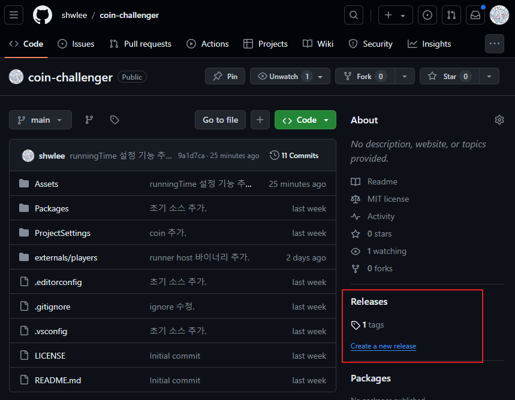


Select one of the listed releases and check the `Assets` section.    
(Please down load latest version release.)

<br>


2. In the `Assets` section under the release, you’ll find a zip file.

<br>

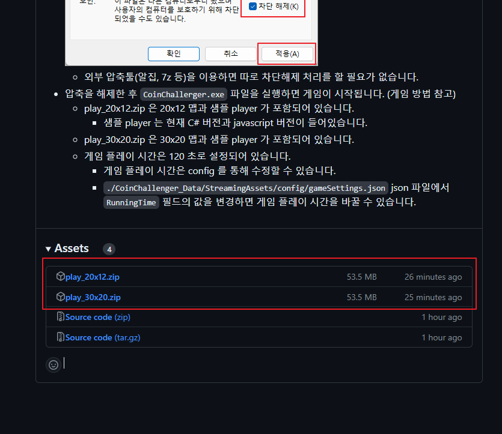

The zip file contains the game’s executable binary. Download it.
- The zip file includes a specific map and a sample player.
- Example: `play_20x12.zip` contains a map of size 20x12 and a sample player.

<br>

**!ATTENTION!**

Since the file is downloaded from the internet, Windows will block it by default. You need to unblock the zip file before extracting it.

<figure align="center">
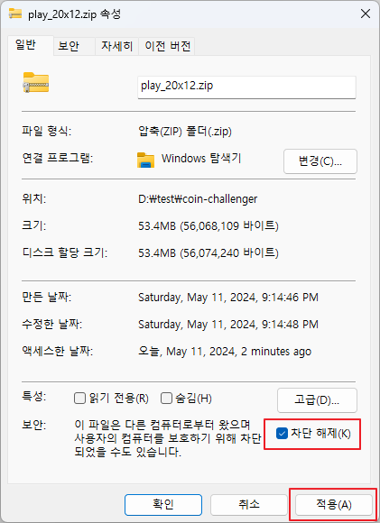</img>
<figcaption>This image is taken from Windows11 in Korean. Please check your OS.</figcaption>
</figure>

(Using external tools like 7z or ALZip will automatically unblock the file during extraction.)

<br>

After unblocking, extract the file. You will see the following file structure:

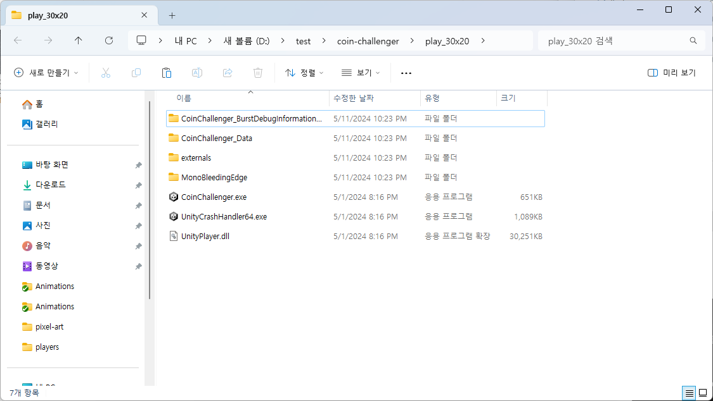

3. Run the game by executing the `CoinChallenger.exe` file.

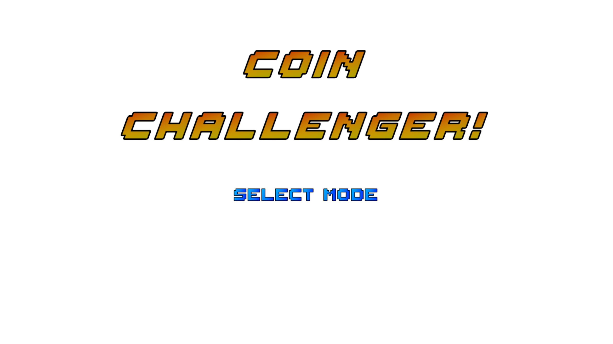

<br>

When the `SELECT MODE` screen appears, press `Enter` to start the game.

(Give it a try!)
<br>
<br>


## It might not work perfectly on the first run...

Let’s go over the game menu.

During the `SELECT MODE` screen at the start, you can choose the game mode.

The game offers 3 modes. Use your keyboard to select a mode:
- Contest mode (**Enter key**)
  - The standard game mode. Loads 4 players for the game.
  - If less than 4 players are loaded, the remaining spots are filled with dummy players.
- Test mode (**F10 key**)
  - A single-player test mode.
  - Only one dummy is loaded in this mode.
  - The dummy can be moved using the arrow keys in test mode.
- Single mode (**Number keys 1 ~ 4**)
  - Loads one player based on the files in the player code folder.
  - The number key determines the starting position:
    - 1: Top-left, 2: Top-right, 3: Bottom-left, 4: Bottom-right.

<br>

After selecting the mode, player loading begins. At this point, the ***Player Host*** is executed.

> **What is the Player Host?**    
&emsp; - It’s an external process that runs the algorithm file for each player.   
&emsp; - Different processes are executed depending on the platform (C#, JavaScript, python, etc.):   
&emsp; &nbsp; &nbsp; - For C#, an ASP.NET Core 8 Web API host process is run.    
&emsp; &nbsp; &nbsp; - For JavaScript, a Node.js host process is executed.    
&emsp; &nbsp; &nbsp; - For pyhton, 3.12.7 version FAST api host process is executed.    
&emsp; - The game and host processes communicate with each other to run the game.

<br>

During the first run, Windows might prompt you to allow the Player Host to execute. Click `Allow`.

<figure align="center">
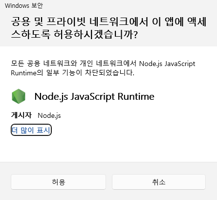</img>
<figcaption>This image is taken from Windows11 in Korean. Please check your OS.</figcaption>
</figure>


<br>
<br>


Once the game loads successfully, you’ll see the message `PRESS THE ENTER...`.

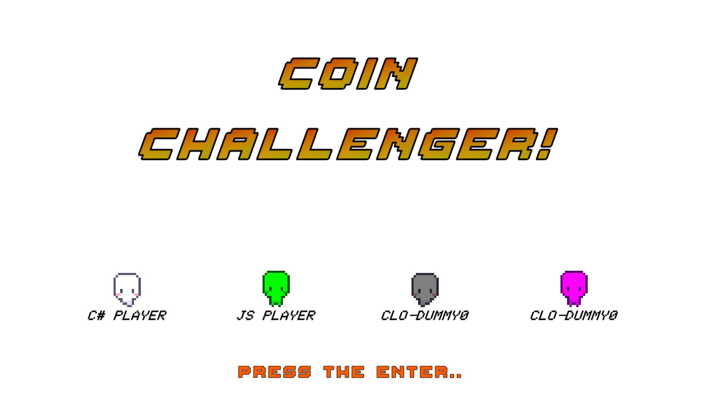

Hit the Enter key! o_o/

<br>

After a countdown, the game starts.

<br>
<br>

## Gameplay

After the countdown, the game begins.

The game is a competition to see who can collect the most coins on the map.    
(The gameplay looks roughly as shown below.)

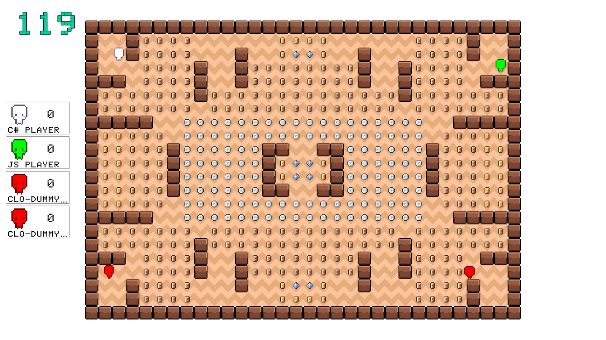

Each player starts at a designated position and moves one tile per turn, guided by their algorithm.
(Dummy players are represented in red.)

When all coins on the map are collected, the game ends, and scores determine the rankings.

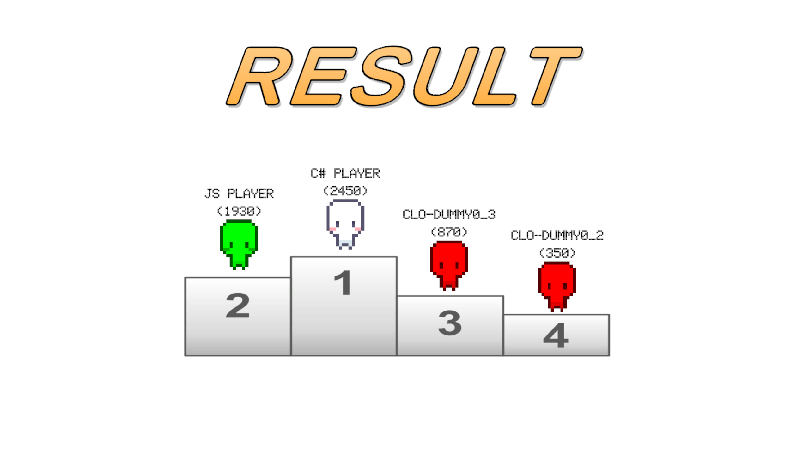

<br>
<br>
<br>
<br>

## Still not clear?

Here’s a simple flowchart summarizing the process.

<br>

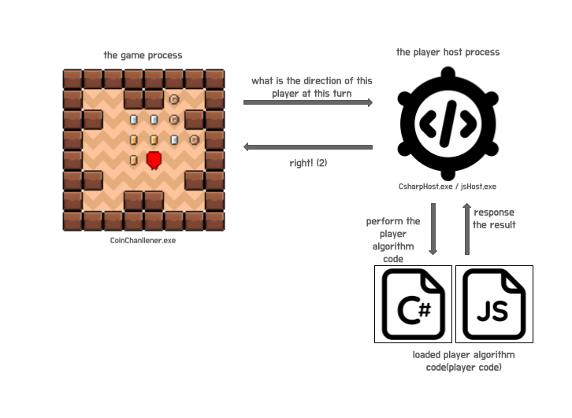

<br>

The process can be broken down as follows:

1. Game Preparation    
&nbsp; &nbsp;- Run the game (`CoinChallenger.exe`) -> Load player code -> Execute Player Host (`CsharpHost.exe` / `jsHost.exe`)

2. Game Progression    
&nbsp; &nbsp;- The game process requests the next move from the Player Host for each turn ->    
&nbsp; &nbsp;- The Player Host executes the loaded player code \(algorithm\) to decide the direction ->    
&nbsp; &nbsp;- The game process moves the player in the returned direction.    

<br>

Now you get the idea, right?

So, what’s next?

<br>
<br>
<br>

## It’s time to write your algorithm.

Now, you need to write an algorithm to maximize coin collection.

> Yes, that’s right.    
This game is powered by your algorithm.

Write your algorithm in C# or JavaScript, Python,

place the file in the game folder,

and run the game to see the results.

<br>

Let’s dive into how to write your algorithm.

<br>
<br>

---

The game requires your algorithm code     
(referred to as `Player Code`).    

Algorithm codes can be written in C# or JavaScript, Python.   

The sample code included in the folder acts as a template.

Use it as a base to write your own algorithm.

Place your completed algorithm file in the following folder relative to the `CoinChallenger.exe` executable:

```
./externals/players
```

This folder already contains sample code. Keep the number of files in this folder under 4 to avoid loading issues.

Now, here’s a detailed guide to writing your algorithm.

<br>
<br>

### How to Write Your Algorithm Code

The game process communicates with your player code as follows:    
(additionally, there's no problem writing algorithms without knowing this structure, just in case you're curious...)

```
Game process -> Request player host to load player code  
  -> Player host loads player code and retains the instance  
Game process -> After the game starts, request the player host to call MoveNext()  
  -> Player host calls the requested player's instance MoveNext() -> 
    Player code returns the direction to move for this turn -> 
Game process -> Moves the target player based on the received value.
```

This process is abstracted, so you only need to focus on implementing the required methods in your code. Below is the structure and requirements for each method.

#### 1. Player Code Loading
The game loads your algorithm files from the following folder:

```
./externals/players
```

Only files with `.cs` (C#) or `.js` (JavaScript) or `.py` (Python) extensions are recognized.

When the player code is loaded, the game creates a player instance. Before the game begins, the game calls the `Initialize(int myNumber, int column, int row)` method in your code to provide essential information about the game.

- **`Initialize(int myNumber, int column, int row)`**:
  - `myNumber`: Your player’s assigned number.
  - `column`, `row`: The dimensions of the game board.
  - Store this information for use during gameplay.

The game also calls the **`GetName()`** method in your code to retrieve your player’s name. This name will appear in the game for score tracking.

<br>

#### 2. Game progression with your code

---
After the player and map loading is complete, the game begins. The game proceeds as follows:

```
The player moves through the map one cell at a time.
The player moves one cell per turn.
At the start of each turn, the player's code is called to determine the direction in which the player will move.
  -- The current map information and player's position are provided to execute the algorithm.
Once the player code returns a direction, the player moves one cell in that direction.
If the player collides with a coin during movement, they score points equal to the value assigned to that coin (after which the coin is removed).
If the player encounters a wall, they cannot move and will lose one turn.
The game ends when all coins in the map have been collected or disappear.
```

**Ultimately, the goal of the game is to implement the int MoveNext(int[] map, int myPosition) method of the player's code.**

---

Now, let's see how to implement the actual code.

Below is a sample code with each detail explained.

First, let's explain the C# player.

<br>

```csharp
using System;

namespace CSharpPlayer
{
    /// <summary>
    /// This is a sample code. Please re-write it in a separate file.
    /// <para>The namespace should be `CSharpPlayer`, and the class name should be `Player` (mandatory).</para>
    /// <para>The access modifiers for the required methods GetName(), Initialize(), MoveNext() should be public.</para>
    /// </summary>
    public class Player
    {
        private int _myNumber;
        private int _column;
        private int _row;

        /// <summary>
        /// Initializes the Player. The game environment is passed as an argument, and this should be retained throughout the game.
        /// </summary>
        /// <param name="myNumber">Assigned this player number (play order).</param>
        /// <param name="column">The number of columns in the current board.</param>
        /// <param name="row">The number of rows in the current board.</param>
        public void Initialize(int myNumber, int column, int row)
        {
            _myNumber = myNumber;
            _column = column;
            _row = row;
        }

        /// <summary>
        /// Returns the player's name. Hardcodes and returns the current player's name.
        /// </summary>
        /// <returns>Current player's name.</returns>
        public string GetName()
        {
            return "c# player";
        }

        /// <summary>
        /// Determines the direction in which the current player will move this turn using the received map information and the current player's position, then returns it.
        /// <para>The decided direction should be represented as an integer, where left, up, right, down correspond to 0, 1, 2, 3 respectively.</para>
        /// </summary>
        /// <param name="map">Current map information represented as a one-dimensional array.</param>
        /// <param name="myPosition">Current player's position, indicated by the index of the map array.</param>    
        /// <returns>The direction to proceed this turn, represented as 0 for left, 1 for up, 2 for right, 3 for down. -1 indicates an error.</returns>
        public int MoveNext(int[] map, int myPosition)
        {
            var random = new Random();
            var direction = random.Next(4);
            return direction;
        }
    }
}
```

You can write a class like the one shown above.

It doesn't matter what tool you use to write the code. Just make sure to place the final file in the game folder (`./externals/players`).  
(Still, the syntax should be correct, as long as there are no build errors.)

In the class, you must implement the following three methods:

```csharp
public void Initialize(int myNumber, int column, int row)
public string GetName()
public int MoveNext(int[] map, int myPosition)
```

Make sure to implement these methods as described in the code.

<br>

Below is an example of map information.

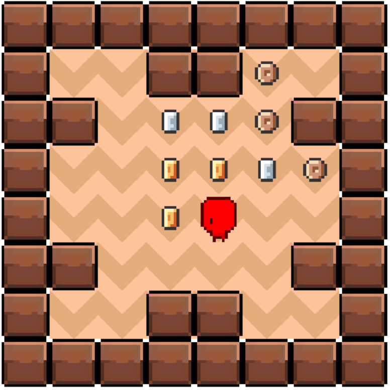

<br>

The map in the above form is represented as follows:

column: 6  
row: 6

```
0       0       -1      -1      10      0
-1      0       30      30      10      -1
0       0       100     100     30      10
0       0       100     0       0       0
-1      0       0       0       0       -1
0       0       -1      -1      0       0
```

0 represents a space that can be moved to, -1 represents a wall (impassable), and numbers greater than 0 represent coins.

In the game, there are five types of coins: copper, silver, gold, diamond, and blackMatter.

Each coin has the following values:

```
    Copper = 10,
    Silver = 30,
    Gold = 100,
    Diamond = 200,
    BlackMatter = 500
```

These coins are represented directly as numbers in the map information. (Example: A gold coin is represented as 100 in the map's integer array.)

<br>
<br>

To give an example of an actual call (if the game proceeds on the above map):

In each turn, the game process calls the `MoveNext(int[] map, int myPosition)` method of the player code.  
At this time, the current map information is passed as an `int array`, and the current player's position is also passed as an index value of the map array.

Thus, the player code is called in the following format during the game process:

```csharp
int[] map = new[] {0,0,-1,-1,10,0,-1,0,30,30,10,-1,0,0,100,100,30,10,0,0,100,0,0,0,-1,0,0,0,0,-1,0,0,-1,-1,0,0};
var direction = MoveNext(map, 21); // The player is at index 21.
```

`int MoveNext(int[] map, int myPosition)` must return an integer from 0 to 3.

Each integer represents the direction to move in this turn (0: left, 1: up, 2: right, 3: down).

Therefore, you must write an algorithm in the `MoveNext(int[] map, int myPosition)` method to decide the direction your player will proceed in this turn.

This is the core of this game. ㅇㅅㅇ!

<br>

> *Note*  
-1 as the return value of MoveNext() indicates an error (precisely, a value less than 0).  
If MoveNext() returns -1, the player will skip one turn (penalty!).  
If not intended, make sure MoveNext() does not return -1.

<br>

So then

<span style="font-size:10;">Good luck!</span>

<br>

#### Guidelines for writing JavaScript files.
---

JavaScript player code must be written as a module that can be recognized by Node.js.

Below is a sample code explaining each detail:

```js
// sample
class JsRunner {
    constructor() {
        this._column = 0;
        this._row = 0;
        this._myNumber;
    }

    // Initializes the Player. Receives the game environment as an argument and should retain it throughout the game.
    // int: myNumber = Assigned player number (play order).
    // int: column = Number of columns in the current board.
    // int: row = Number of rows in the current board.
    // The method name must match the one below.
    initialize(myNumber, column, row) {
        this._myNumber = myNumber;
        this._column = column;
        this._row = row;
    }

    // Returns the player's name. Hardcode and return the current player's name (recommended).
    // The method name must match the one below.
    getName() {
        return "javascript player";
    }

    // Decides the direction to move in the current turn. Receives the map information and the current player's position, then returns the next movement direction.
    // The decided direction should be represented as 0, 1, 2, 3 for left, up, right, down respectively.
    // map: int[]  One-dimensional array representing the current map information.
    // myPosition:int Current player's position, represented by the index of the map array.
    // returns: The direction to proceed this frame, represented as 0 for left, 1 for up, 2 for right, 3 for down (-1 indicates an error).
    // The method name must match the one below.
    moveNext(map, myPosition) {
        let min = 0;
        let max = 3;
        min = Math.ceil(min);
        max = Math.floor(max);
        let selectedIndex = Math.floor(Math.random() * (max - min + 1)) + min;
        return selectedIndex;
    }    
}

module.exports = JsRunner; // Required.
```

The JavaScript player code must be written as a class and exported for use as a module in Node.js.

All other content is the same as in C#.

<br>
<br>

---

#### Guidelines for Writing Python Files

The project uses Python version 3.12.7. Compatibility with other versions cannot be guaranteed.

The following dependencies are preloaded on the Python host:

```
annotated-types==0.7.0
anyio==4.6.0
click==8.1.7
colorama==0.4.6
fastapi==0.115.0
h11==0.14.0
idna==3.10
pydantic==2.9.2
pydantic_core==2.23.4
python-multipart==0.0.12
setuptools==75.1.0
sniffio==1.3.1
starlette==0.38.6
typing_extensions==4.12.2
uvicorn==0.31.0
wheel==0.44.0
cx_Freeze==7.2.4
```

Please ensure that your code is written using these dependencies whenever possible (note that dependencies may be updated over time).

Below is a sample code snippet:

```python
import random

"""
The class name should be fixed as Player.
"""
class Player:
    def __init__(self):
        self._my_number = None
        self._column = None
        self._row = None

    def get_name(self) -> str:
        """
        Returns the name of the player.
        """
        return "python player"

    def initialize(self, my_number: int, column: int, row: int):
        """
        Initializes the player.
        :param my_number: Player number
        :param column: Column size
        :param row: Row size
        """
        self._my_number = my_number
        self._column = column
        self._row = row

    def move_next(self, map: list[int], my_position: int) -> int:
        """
        Decides the next move for the player.
        :param map: The game map information
        :param my_position: The current position of the player
        :return: A random direction (0: Up, 1: Right, 2: Down, 3: Left)
        """
        direction = random.randint(0, 3)
        return direction
```

For all other content, please refer to the C# or JavaScript versions, as they are similar.

<br>
<br>

### Important Notes for Writing Algorithms (IMPORTANT!!!!)
---

When writing the code, there are some important things to consider.

```
- Restrict the use of functionalities that could disrupt the game.

- Only the built-in functionalities provided by the language can be used.
  (No external libraries or third-party code imports are allowed.)

- The game is meant to be a pure algorithm implementation. Asynchronous or parallel code (including threads and tasks) is not allowed.

- Code that causes a delay in code execution (e.g., sleep) is prohibited.

- The external or internal web/socket usage is not allowed.

- Do not use any code that can interfere with or interrupt game progression.

- Everything you need to run your algorithm should be written in 1 file.(just 1 file!)
```

Additionally,

If an error occurs in the algorithm during the game, the player will lose one turn.

Please focus on writing a pure and highly efficient algorithm (maximize coin scores!) without errors. +ㅅ+/

<br>
<br>

### Good Things to Know
---

<br>

- Player Host.

The player host mentioned earlier is stored as an executable binary.

The default storage location of the binary, based on the `CoinChallenger.exe` file, is as follows:

```
// C# host
./CoinChallenger_Data/StreamingAssets/Runners/Windows/CSharpHost/CSharpHost.exe

// javascript host
./CoinChallenger_Data/StreamingAssets/Runners/Windows/JsHost/jsHost.exe

// python host
./CoinChallenger_Data/StreamingAssets/Runners/Windows/PyHost/PyHost.exe
```

After the game starts and player loading is completed, the host file located in the above paths is executed.

Each player host file is an HTTP API process, and run on the local host.(on your machine.)

When the game ends normally, it terminates along with it.

The location of each player host executable can be adjusted via the gameSettings.json file.
```
./CoinChallenger_Data/StreamingAssets/config/gameSettings.json
```

gameSettings.json stores/adjusts the location of the player host executable and the port information used by the  player host.  
(The default ports used are 50109 and 50209.)

\* Note  
The C# player host uses the .NET8 runtime. It is built using the .NET8 framework-dependent method, so it will not work properly without the .NET8 runtime or SDK.  
Please install the .NET8 runtime first.  
(https://dotnet.microsoft.com/ko-kr/download/dotnet/8.0 Windows x64 version is required.)

<br>
<br>

- If player loading fails at the start of the game (`when there is an error in the player code`), the game cannot proceed further.

If player loading fails after starting the game and making all selections, the corresponding player will be marked with :x: (`ERROR!!`) as shown below, and the game cannot continue.

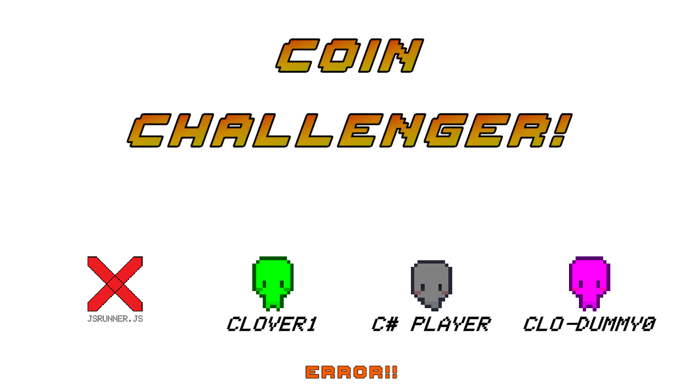

*(Image showing an error while loading JSRUNNER.JS file)*

<br>

If there is an error in any of the loading targets, the game will not proceed. At the very least, all players must be loaded successfully.

If player loading fails, press `ESC` to quit the game, and either delete or modify the failed player code file from the `./externals/players` folder and restart the game.

<br>
<br>

- gameSettings.json

gameSettings.json is a configuration file that stores information needed for game execution. It is stored in the following location:
```
./CoinChallenger_Data/StreamingAssets/config/gameSettings.json
```

After modifying the gameSettings.json file, restart the game to proceed with the updated values.

The current values adjustable in gameSettings.json are as follows:

```
- Set game time limit (RunningTime)
- C# host binary location (CsharpHostPath)
- C# host execution port (CsharpHostport)
- JavaScript host binary location (JsHostPath)
- JavaScript host execution port (JsHostPath)
- Cpp host binary location (CppHostPath) -- currently not supported.
- Cpp host execution port (CppHostPort) --  currently not supported.
- Python host bianry location (PyHostPath)
- Python host execution port (PyHostPort)
- Whether to terminate player host with game termination (CloseWithoutPlayerHostExit)
- Whether to use a random gimmick in the game (UseRandomGimmick)
```

<br>
<br>

- HurryUp mode  

When the countdown timer in the top left runs out to 0 during gameplay, the game enters HurryUp mode.

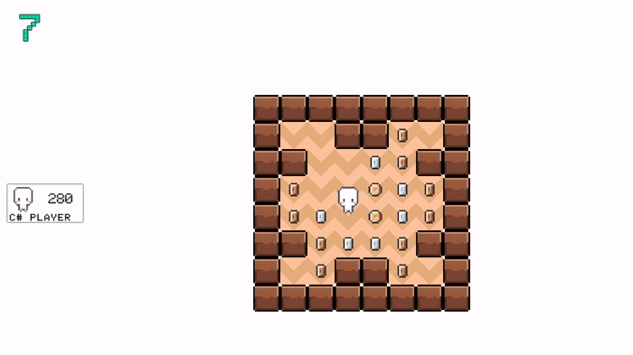

When HurryUp mode begins, the map background flashes red and remaining coins are removed one by one.

If all the coins are removed, the game ends.  
(The game does not enter HurryUp mode if all coins are removed before the time runs out.)

<br>
<br>

- Pressing ENTER during gameplay will immediately switch to the `RESULT` screen.

The ranking is determined based on the score right before the screen switches.

<br>
<br>

- There is no `GAME OVER` in TEST mode.

In TEST mode (F10), the game does not automatically end. (HurryUp mode can still be triggered)  
You can end the game by pressing `ESC`, or switch to the `RESULT` screen by pressing ENTER and then pressing `ESC` to exit.

TEST mode only loads dummy players, so no player host is executed.

<br>
<br>

- Coin Removal

Coins can be removed by left-clicking with the mouse in all modes except Contest mode.

<br>
<br>

- Random Gimmick

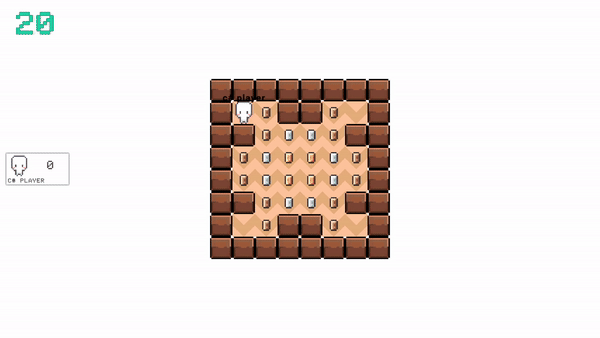

gameSettings.json has a `UseRandomGimmick` field that, when set to true, activates the random gimmick after the game starts.  
The random gimmick is designed to test how well the player's algorithm can adapt to changes and pursue high efficiency.  
Instead of simply chasing predefined coins, responding well to the changing map situation in real-time is key.

The random gimmick has two possible events:

1) Block Destruction!  
After the game starts, blocks within the map are destroyed at regular intervals.  
This continues until all blocks within the map are destroyed.

2) BlackMatter Appearance!  
The most valuable coin in the game, BlackMatter (500), appears randomly.  
Every 15 seconds after the game starts, BlackMatter is generated at random locations. The random locations are empty spaces excluding those occupied by the player and within a 2-tile radius around the player (restricted generation locations).   

!! Example (locations marked with x indicate restricted generation locations)

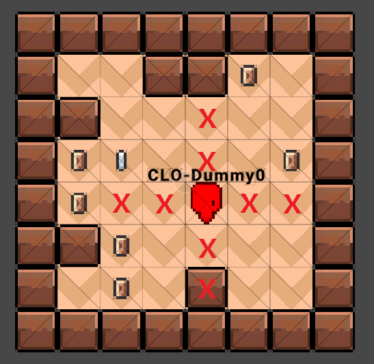

Based on the map above, BlackMatter will not be generated in the locations occupied by players or empty spaces within a 2-tile radius of players (restricted locations).  
Across all players, excluding restricted locations, BlackMatter is generated randomly in four possible locations (if there are no available spaces, it will not be generated).  
BlackMatter stops appearing when HurryUp mode begins or if the game ends before then.

<br>
<br>

- Quitting the Game

Pressing the ESC key exits the game in all scenes except during `LOADING`.

After Game Over, pressing the ESC key on the `RESULT` screen will also exit the game, along with all player host processes.

In other cases, when exiting the game, player host processes may not be terminated properly. (*Caution)

<br>
<br>

- Reusing Player Hosts

As mentioned above, when the game is closed, player hosts are also terminated.

However, having the player hosts start and stop with each game is rather wasteful.

To address this, there is a function to keep the player host running after it starts.

If you set the `CloseWithoutPlayerHostExit` field to true in gameSettings.json and start the game,

when the game ends, the player host will not be terminated (allowing it to immediately respond to requests in the next game).

** Setting the `CloseWithoutPlayerHostExit` field to false in gameSettings.json will restore the original behavior, where the player host is terminated at the end of each game.

Regardless of this setting, pressing `Left Shift + ESC` to exit the game will always terminate the player host as well.

<br>
<br>

- Recording Game Results

After Game Over, pressing the ESC key on the `RESULT` screen will record the game information as a JSON file in the following folder, based on the final score ranking:

```
./externals/Results/Result_{datetime}.log

{
    "Results": [
        {
            "Rank": 0,
            "Name": "c# player",
            "Score": 2450
        },
        {
            "Rank": 1,
            "Name": "js player",
            "Score": 1930
        },
        {
            "Rank": 2,
            "Name": "CLO-Dummy0_3",
            "Score": 870
        },
        {
            "Rank": 3,
            "Name": "CLO-Dummy0_2",
            "Score": 350
        }
    ]
}
```

**if you exit the game before entering the `RESULT` screen, no result will be recorded.**

<br>
<br>

- Player Host Log

Each player host maintains a record of its algorithm execution in the ./logs folder.

For each turn, the map information, the player's current position, and the final algorithm result are logged in JSON format.
The log file contains the following information:

```
turn = The turn number in which the player's MoveNext() was called.
position = The starting position of the player.
map = The map information at the time the turn was called.
current = The current position of the player during that turn.
result = The result of the algorithm execution.
error = Error details if an error occurs.
```

The log file content is formatted as follows:


```
[20241116-195630:2024-11-16 19:56:42] 
{
    "turn":1,
    "position":0,
    "map":[0,0,-1,10,10,10,10,0,0,0,0,0,0,100,100,100,100,0,0,0,0,0,0,10,10,10,10,-1,0,0,0,0,-1,10,10,10,10,0,0,0,-1,0,0,100,200,200,100,0,0,-1,0,0,0,10,10,10,10,-1,0,0,0,0,0,10,10,10,10,-1,0,0,-1,10,10,10,10,10,10,10,10,-1,0,0,-1,10,10,10,10,0,0,0,-1,-1,0,10,10,10,10,-1,0,0,-1,10,10,10,10,10,10,10,10,-1,0,0,-1,10,10,10,10,0,-1,-1,10,10,10,10,10,10,10,-1,10,10,10,10,10,10,10,10,10,10,10,10,10,10,-1,10,10,10,10,10,10,10,10,10,10,10,10,10,10,0,10,10,10,10,10,10,10,10,10,10,10,10,10,10,0,10,10,10,10,10,10,10,-1,-1,-1,-1,0,0,30,30,30,30,30,30,30,30,30,30,30,30,30,30,30,30,30,30,0,0,-1,-1,-1,-1,100,100,10,10,10,0,30,30,30,30,30,30,30,30,30,30,30,30,30,30,30,30,30,30,0,10,10,10,100,100,100,100,10,10,10,-1,30,30,30,30,30,30,-1,-1,0,0,-1,-1,30,30,30,30,30,30,-1,10,10,10,100,100,100,100,10,10,10,-1,30,30,30,30,30,30,-1,100,200,200,100,-1,30,30,30,30,30,30,-1,10,10,10,100,100,100,100,10,10,10,-1,30,30,30,30,30,30,-1,100,200,200,100,-1,30,30,30,30,30,30,-1,10,10,10,100,100,100,100,10,10,10,-1,30,30,30,30,30,30,-1,-1,0,0,-1,-1,30,30,30,30,30,30,-1,10,10,10,100,100,100,100,10,10,10,0,30,30,30,30,30,30,30,30,30,30,30,30,30,30,30,30,30,30,0,10,10,10,100,100,-1,-1,-1,-1,0,0,30,30,30,30,30,30,30,30,30,30,30,30,30,30,30,30,30,30,0,0,-1,-1,-1,-1,10,10,10,10,10,10,10,0,10,10,10,10,10,10,10,10,10,10,10,10,10,10,0,10,10,10,10,10,10,10,10,10,10,10,10,10,10,-1,10,10,10,10,10,10,10,10,10,10,10,10,10,10,-1,10,10,10,10,10,10,10,-1,-1,0,10,10,10,10,-1,0,0,-1,10,10,10,10,10,10,10,10,-1,0,0,-1,10,10,10,10,0,-1,-1,0,0,0,10,10,10,10,-1,0,0,-1,10,10,10,10,10,10,10,10,-1,0,0,-1,10,10,10,10,0,0,0,0,0,-1,10,10,10,10,0,0,0,-1,0,0,100,200,200,100,0,0,-1,0,0,0,10,10,10,10,-1,0,0,0,0,-1,10,10,10,10,0,0,0,0,0,0,100,100,100,100,0,0,0,0,0,0,10,10,10,10,-1,0,0],
    "current":0,
    "result":(2)Right
}
[20241116-195630:2024-11-16 19:56:42] 
{
    "turn":2,
    "position":0,
    "map":[0,0,-1,10,10,10,10,0,0,0,0,0,0,100,100,100,100,0,0,0,0,0,0,10,10,10,10,-1,0,0,0,0,-1,10,10,10,10,0,0,0,-1,0,0,100,200,200,100,0,0,-1,0,0,0,10,10,10,10,-1,0,0,0,0,0,10,10,10,10,-1,0,0,-1,10,10,10,10,10,10,10,10,-1,0,0,-1,10,10,10,10,0,0,0,-1,-1,0,10,10,10,10,-1,0,0,-1,10,10,10,10,10,10,10,10,-1,0,0,-1,10,10,10,10,0,-1,-1,10,10,10,10,10,10,10,-1,10,10,10,10,10,10,10,10,10,10,10,10,10,10,-1,10,10,10,10,10,10,10,10,10,10,10,10,10,10,0,10,10,10,10,10,10,10,10,10,10,10,10,10,10,0,10,10,10,10,10,10,10,-1,-1,-1,-1,0,0,30,30,30,30,30,30,30,30,30,30,30,30,30,30,30,30,30,30,0,0,-1,-1,-1,-1,100,100,10,10,10,0,30,30,30,30,30,30,30,30,30,30,30,30,30,30,30,30,30,30,0,10,10,10,100,100,100,100,10,10,10,-1,30,30,30,30,30,30,-1,-1,0,0,-1,-1,30,30,30,30,30,30,-1,10,10,10,100,100,100,100,10,10,10,-1,30,30,30,30,30,30,-1,100,200,200,100,-1,30,30,30,30,30,30,-1,10,10,10,100,100,100,100,10,10,10,-1,30,30,30,30,30,30,-1,100,200,200,100,-1,30,30,30,30,30,30,-1,10,10,10,100,100,100,100,10,10,10,-1,30,30,30,30,30,30,-1,-1,0,0,-1,-1,30,30,30,30,30,30,-1,10,10,10,100,100,100,100,10,10,10,0,30,30,30,30,30,30,30,30,30,30,30,30,30,30,30,30,30,30,0,10,10,10,100,100,-1,-1,-1,-1,0,0,30,30,30,30,30,30,30,30,30,30,30,30,30,30,30,30,30,30,0,0,-1,-1,-1,-1,10,10,10,10,10,10,10,0,10,10,10,10,10,10,10,10,10,10,10,10,10,10,0,10,10,10,10,10,10,10,10,10,10,10,10,10,10,-1,10,10,10,10,10,10,10,10,10,10,10,10,10,10,-1,10,10,10,10,10,10,10,-1,-1,0,10,10,10,10,-1,0,0,-1,10,10,10,10,10,10,10,10,-1,0,0,-1,10,10,10,10,0,-1,-1,0,0,0,10,10,10,10,-1,0,0,-1,10,10,10,10,10,10,10,10,-1,0,0,-1,10,10,10,10,0,0,0,0,0,-1,10,10,10,10,0,0,0,-1,0,0,100,200,200,100,0,0,-1,0,0,0,10,10,10,10,-1,0,0,0,0,-1,10,10,10,10,0,0,0,0,0,0,100,100,100,100,0,0,0,0,0,0,10,10,10,10,-1,0,0],
    "current":1,
    "result":(3)Down
}
[20241116-195630:2024-11-16 19:56:42] 
{
    "turn":3,
    "position":0,
    "map":[0,0,-1,10,10,10,10,0,0,0,0,0,0,100,100,100,100,0,0,0,0,0,0,10,10,10,10,-1,0,0,0,0,-1,10,10,10,10,0,0,0,-1,0,0,100,200,200,100,0,0,-1,0,0,0,10,10,10,10,-1,0,0,0,0,0,10,10,10,10,-1,0,0,-1,10,10,10,10,10,10,10,10,-1,0,0,-1,10,10,10,10,0,0,0,-1,-1,0,10,10,10,10,-1,0,0,-1,10,10,10,10,10,10,10,10,-1,0,0,-1,10,10,10,10,0,-1,-1,10,10,10,10,10,10,10,-1,10,10,10,10,10,10,10,10,10,10,10,10,10,10,-1,10,10,10,10,10,10,10,10,10,10,10,10,10,10,0,10,10,10,10,10,10,10,10,10,10,10,10,10,10,0,10,10,10,10,10,10,10,-1,-1,-1,-1,0,0,30,30,30,30,30,30,30,30,30,30,30,30,30,30,30,30,30,30,0,0,-1,-1,-1,-1,100,100,10,10,10,0,30,30,30,30,30,30,30,30,30,30,30,30,30,30,30,30,30,30,0,10,10,10,100,100,100,100,10,10,10,-1,30,30,30,30,30,30,-1,-1,0,0,-1,-1,30,30,30,30,30,30,-1,10,10,10,100,100,100,100,10,10,10,-1,30,30,30,30,30,30,-1,100,200,200,100,-1,30,30,30,30,30,30,-1,10,10,10,100,100,100,100,10,10,10,-1,30,30,30,30,30,30,-1,100,200,200,100,-1,30,30,30,30,30,30,-1,10,10,10,100,100,100,100,10,10,10,-1,30,30,30,30,30,30,-1,-1,0,0,-1,-1,30,30,30,30,30,30,-1,10,10,10,100,100,100,100,10,10,10,0,30,30,30,30,30,30,30,30,30,30,30,30,30,30,30,30,30,30,0,10,10,10,100,100,-1,-1,-1,-1,0,0,30,30,30,30,30,30,30,30,30,30,30,30,30,30,30,30,30,30,0,0,-1,-1,-1,-1,10,10,10,10,10,10,10,0,10,10,10,10,10,10,10,10,10,10,10,10,10,10,0,10,10,10,10,10,10,10,10,10,10,10,10,10,10,-1,10,10,10,10,10,10,10,10,10,10,10,10,10,10,-1,10,10,10,10,10,10,10,-1,-1,0,10,10,10,10,-1,0,0,-1,10,10,10,10,10,10,10,10,-1,0,0,-1,10,10,10,10,0,-1,-1,0,0,0,10,10,10,10,-1,0,0,-1,10,10,10,10,10,10,10,10,-1,0,0,-1,10,10,10,10,0,0,0,0,0,-1,10,10,10,10,0,0,0,-1,0,0,100,200,200,100,0,0,-1,0,0,0,10,10,10,10,-1,0,0,0,0,-1,10,10,10,10,0,0,0,0,0,0,100,100,100,100,0,0,0,0,0,0,10,10,10,10,-1,0,0],
    "current":31,
    "result":(3)Down
}
```

Logs can be used for debugging the algorithms that were implemented.

### Game Updates
---

The game is not 100% complete. Bug fixes and other necessary features will be continuously added.

The source code and executable binary will be updated on [GitHub release](https://github.com/shwlee/coin-challenger/releases) as changes are applied.

<br>
<br>

## License

[MIT License](https://opensource.org/license/MIT).

```
Copyright © 2024-present shwlee
```

<br>

